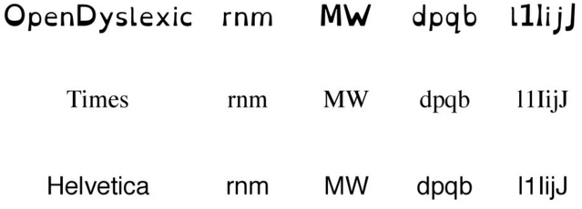
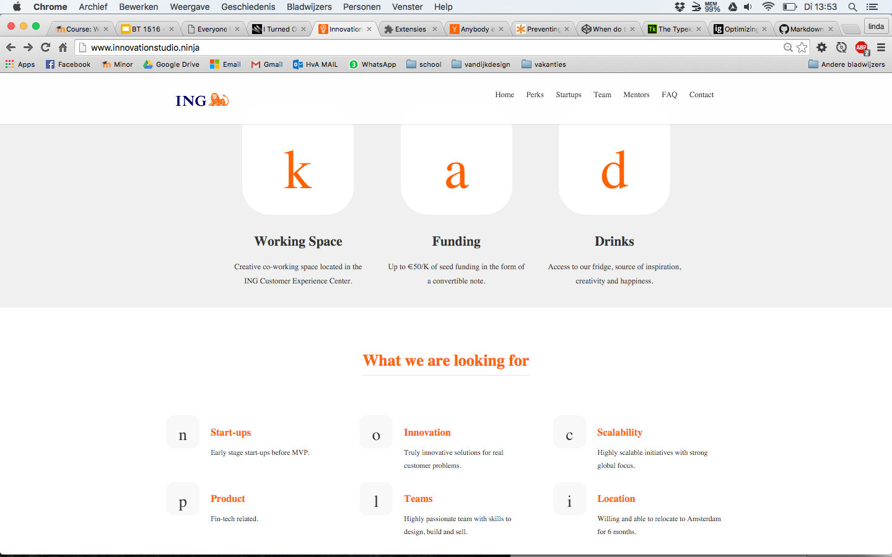
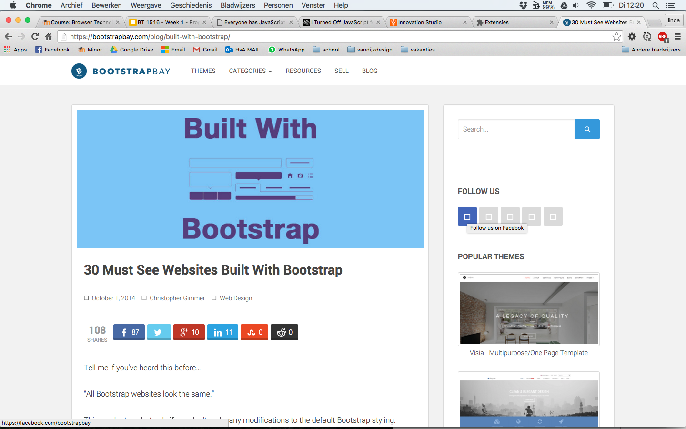

## Opdracht 1.1 - Breek het Web - Features

### 1) Custom fonts

> Problemen Custom fonts

##### "It is very frustrating when loading up a website and seeing a mostly blank page because the fonts are still downloading. This is especially frustrating on a slow internet connection or on mobile."
*-throwaway420* [(Bron)](https://news.ycombinator.com/item?id=7244465)

Feiten
* Custom fonts are awesome and we want to use them 
* Custom fonts slow down our pages by being large additional resources.
* ~37% of top 300K sites are using web fonts as of early 2014 [(bron)](https://www.igvita.com/2014/01/31/optimizing-web-font-rendering-performance/)

> Mogelijke oplossingen:

* Laad alleen @font-face op grote schermen [(bron)](https://css-tricks.com/preventing-the-performance-hit-from-custom-fonts/) 

Voorbeeld:

```bash
@font-face {
  font-family: 'Dr Sugiyama';
  font-style: normal;
  font-weight: 400;
  src: local("Dr Sugiyama Regular"), local("DrSugiyama-Regular"), url(http://themes.googleusercontent.com/static/fonts/drsugiyama/v2/rq_8251Ifx6dE1Mq7bUM6brIa-7acMAeDBVuclsi6Gc.woff) format("woff");
}

body {
  font-family: sans-serif;
}
@media (min-width: 1000px) {
  body {
    font-family: 'Dr Sugiyama', sans-serif;
  }
}
```


* Gebruik ``` visibility: hidden ``` als de webfont aan het laden is. [(bron)](http://blog.typekit.com/2010/10/29/font-events-controlling-the-fout/) 

Voorbeeld:

```bash
<script type="text/javascript" src="http://use.typekit.com/xxxxxxx.js"></script>
<script type="text/javascript">try{Typekit.load();}catch(e){}</script>
<style type="text/css">
  .wf-loading .blog-title,
  .wf-loading .post-title {
    /* Hide the blog title and post titles while web fonts are loading */
    visibility: hidden;
  }
</style>
```

> Nadelen webfonts

* Mensen met dyslectie (1 op de 10) kunnen webfonts vaak nog moeilijker lezen omdat de letters vaak net even anders er uit zien dan een standaard font als Times of Helvetica. Dyslecten zetten daarom vaak de webfonts uit. Maar het probleem dat er dan volgt is dat icon fonts ook niet getoond worden waardoor ze alles moeten lezen omdat er overal nietszeggende blokjes staan. 
* Opera Mini ondersteund geen iconfonts en heeft 350 miljoen+ gebruikers.

voordelen Icon Fonts:
* Ze zijn schaalbaar
* Ze kunnen gestyled worden
* Vermindering van het aantal HTTP-verzoeken

Alernatief? Ja, SVG. 
Voordelen:
* Toegankelijkheid
* Betere beschrijving
* Schaalbaar
* Kan in meerdere kleuren gestyled worden
* Kan geanimeerd worden
* Wordt ondersteund in moderne browsers


> Conclusie

Gebruik web fonts, maar controleer ze regelmatig of ze goed bruikbaar zijn en gebruik ze niet te vaak. Als je ze gebruikt zorg voor een goede fallback font. [(bron)](https://www.igvita.com/2014/01/31/optimizing-web-font-rendering-performance/)
En Gebruik voor icons nooit icon fonts maar bijvoorbeeld SVG's. 


# Eigen ervaring

* De website Innovation Studio is gemaakt met een Bootstrap layout. Bootstrap maakt veel gebruik van icon fonts. Een groot deel van de website breekt dan ook wanneer ik de webfonts uitschakel. [(Bron)](http://www.innovationstudio.ninja/)  

* Op deze website vallen de icons wel weg maar als je er overheen hovered is zichtbaar wat voor icoon het is. [(Bron)](https://bootstrapbay.com/blog/built-with-bootstrap/) 

> Mogelijke oplossingen

* Gebruik svg's in plaats van webicons
* Gebruik geen letters als benaming voor de icons maar voorzich sprekende namen zodat de gebruiks kan zien waar het op slaat.


###2) Muis/Trackpad

> Websites testen zonder muis/trackpad

* [Whatsapp](https://web.whatsapp.com/): De website van Whatsapp is niet te gebruiken zonder muis of trackpad. Het is namelijk niet mogelijk om een chat te openen. Ook wordt er totaal niet aangegeven wat het focus punt is. Dat de focus niet zichtbaar is hebben ze gedaan door middel van de CSS styling ``` outline: none ``` waardoor en geen blauw blok om het focus punt wordt getoont.

* [Gmail](https://mail.google.com): 


> Cases van mensen die echt geen muis/ trackpad kunnen gebruiken
