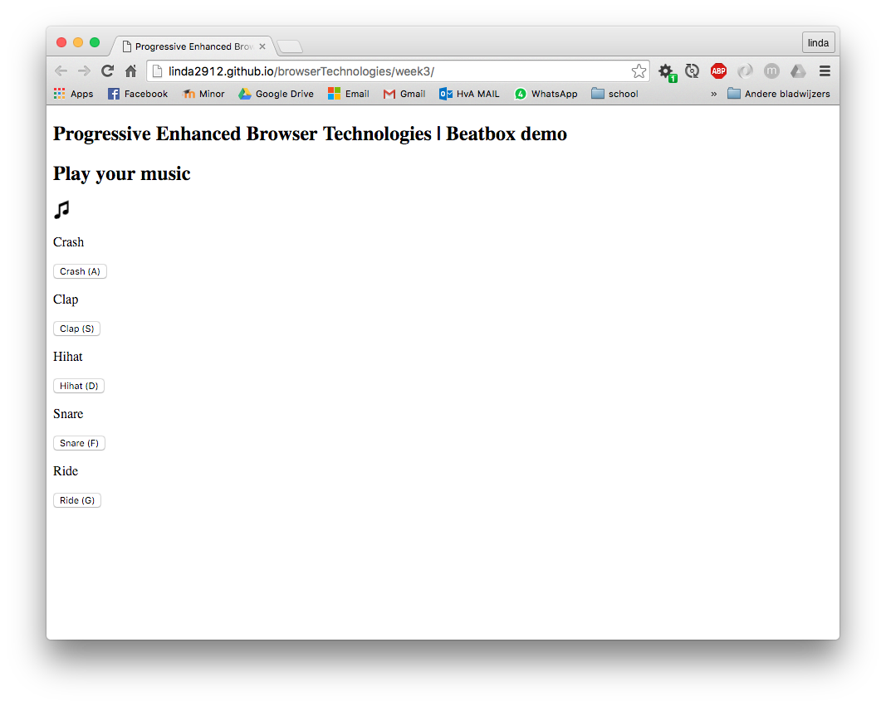
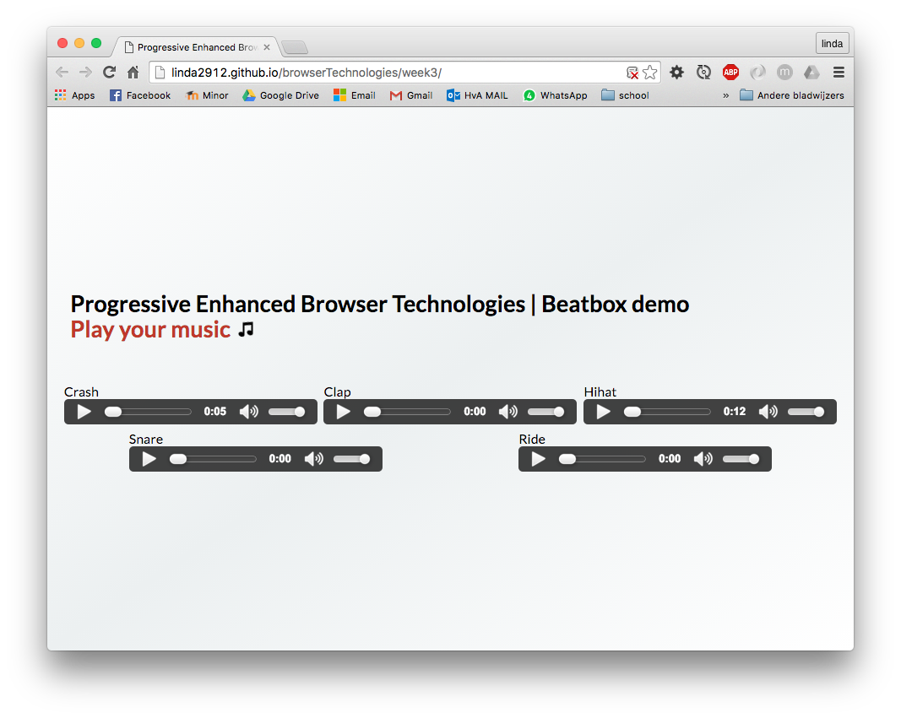
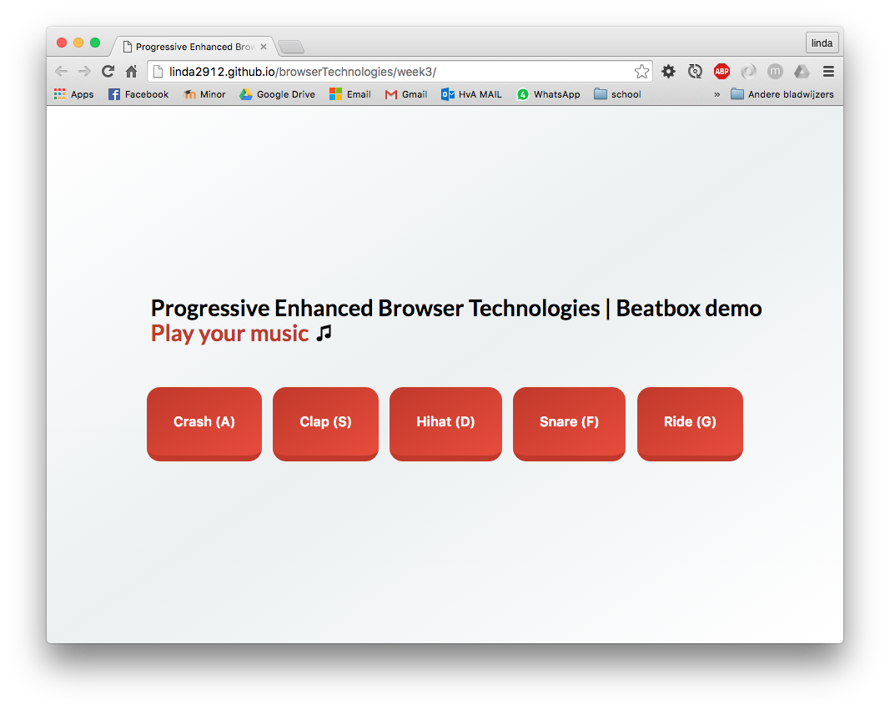
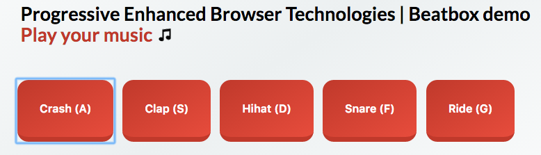
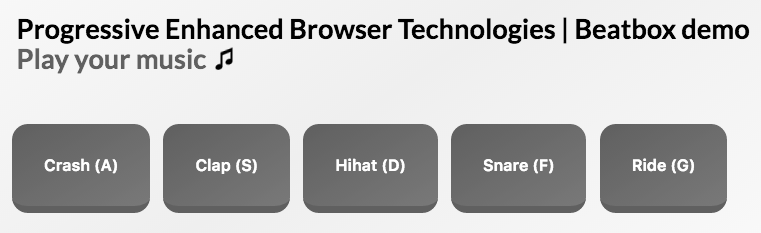
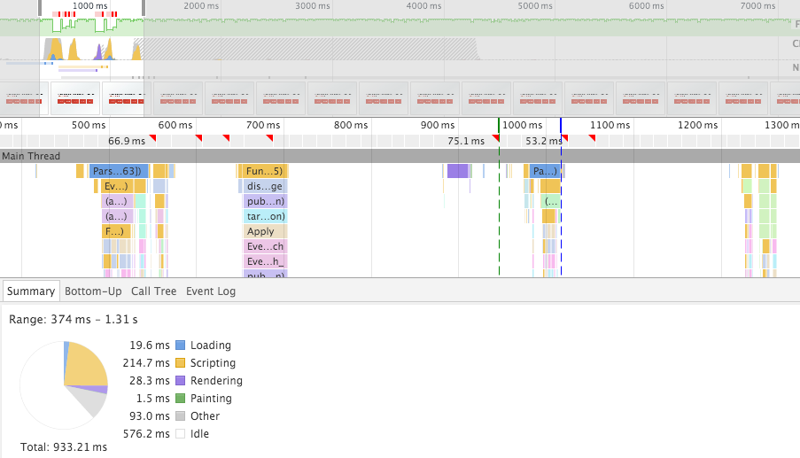

## Lesweek 3 - Progressive Enhanced Browser Technolgies

#### Use case: Beatbox


[Online Demo](http://linda2912.github.io/browserTechnologies/week3/)

##Stap 1: HTML
Ik ben begonnen met het maken van een sematische HTML pagina zodat als de gebruiker geen JavaScript en CSS heeft de pagina nog 'bruikbaar' is. 


####Audio element fallback

Het audio element wordt niet ondersteund door **IE8** en **Opera Mini**. Op deze browsers wordt er het alternatief aangeboden dat de gebruiker de sound kan downloaden en afspelen.


*Oplossing:*

```
<div>
	<p>Crash</p>
	<audio id="crashButton" src="beat/crash.mp3" type="audio/mp3" data-key="65" controls preload="auto" loop>
		<p>Your browser does not support the audio element. </p>
		<a href="beat/crash.mp3">Play Crash</a>
	</audio>
</div>
```
*IE8:*

 

##Stap 2: CSS
Vervolgens heb ik de applicatie vormgegeven met CSS. 



##Stap 3: JavaScript
JavaScript vervangt op een dynamische manier de ```audio``` elementen door ```buttons``` 


####ClassList && audio Fallback
Als de browser geen classlist en/of audio ondersteund dan krijgt de gebruiker de versie zonder JavaScript te zien.

```
if (classListAvailable && mediaSupport) {...}
```


##stap 4: Keyboard

Als extra toevoeging kan de gebruiker door middel van zijn toetsenbord de beatbox bedienen. 

####Fallback
Als de gebruiker niet over een toetsenbord beschikt door dat hij bijvoorbeeld op een mobiel device zit, kan hij gebruik maken van de button om zo de beatbox te bedienen. 

Als het mogelijk was om te detecteren of de gebruiker op een mobiel device zit of door een andere manier niet over een toetsenbord beschikt. Dan zou ik de toetsaanduidingen '(A)' in de applicatie weg willen halen zodra dat van toepassing is.


####Linear-gradient fallback

In de browsers die Linear-gradient niet ondersteunen wordt de ```background-color``` opgevangen door een 'normale' background-color


```
background-color: #c0392b;
background: linear-gradient(to bottom right, #c0392b , #e74c3c);
```


Linkerkant is met linear-gradient, rechts zonder.

##Accessibility issues

* Muis/Trackpad
* JavaScript(volledig)
* Geen Css
* Kleur
* Breedband internet

###Muis/Trackpad

De gebruiker kan met zijn tab functie door de applicatie navigeren en de beatbox bedienen


###JavaScript(volledig)
De applicatie werkt zonder JavaScript doordat er een ```preload="auto"``` op het audio element in de html zit.

###Geen CSS
De app werkt ook zonder CSS doordat de HTML opzichzelf al functioneel is.

###Kleur
* Het contrast ratio van de applicatie is hoog genoeg. 


* Ook in zwart/ wit is de app goed leesbaar


###Breedband internet
Netwerk: 2G: 250kb/s


