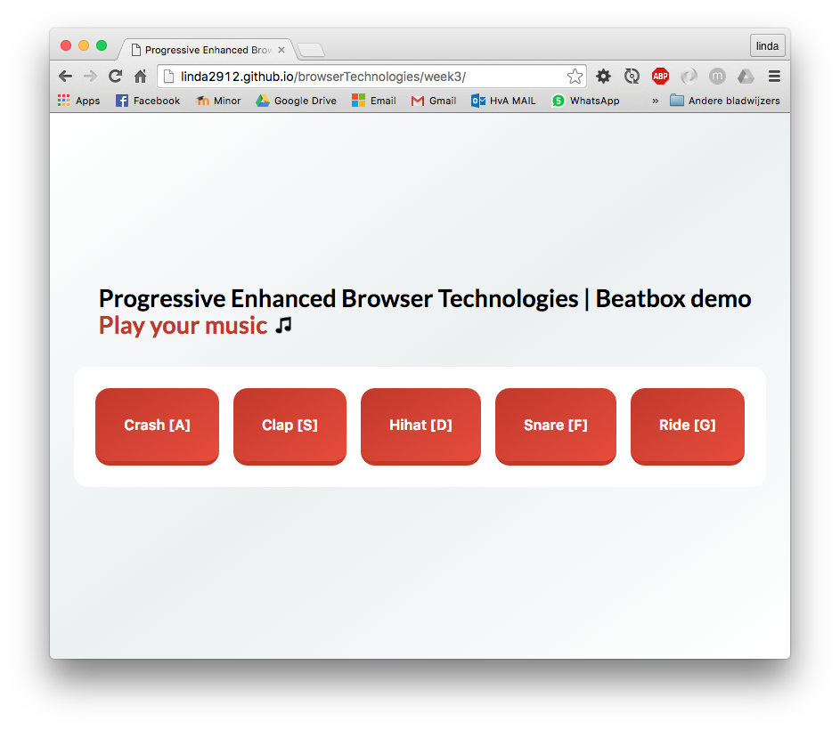
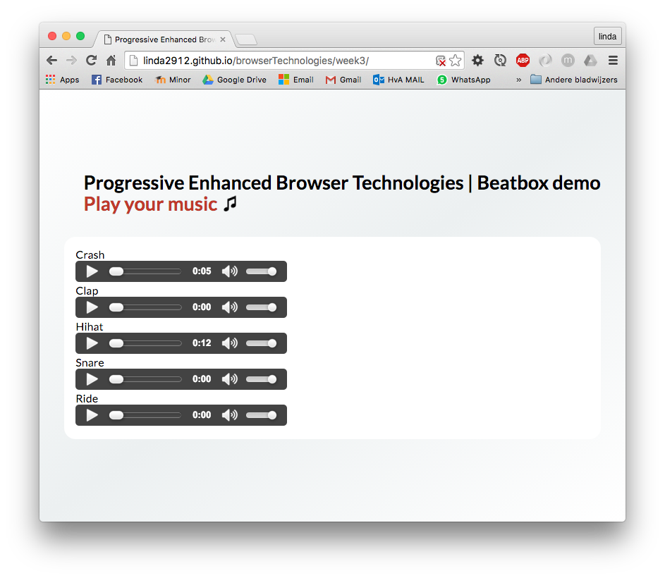
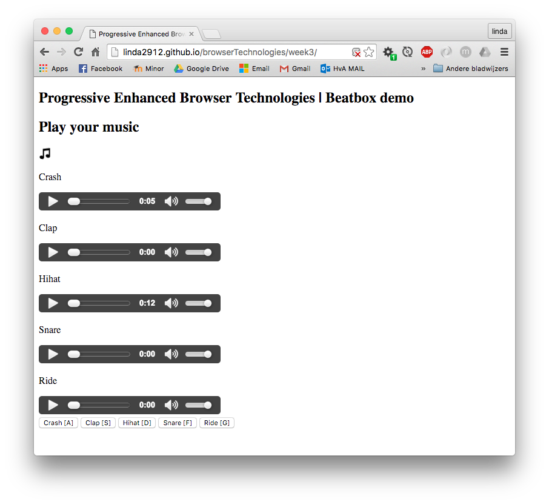
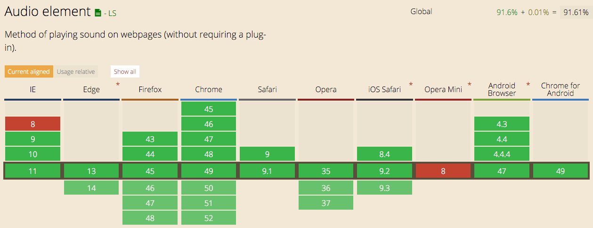
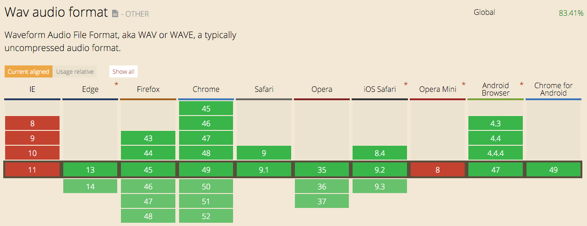
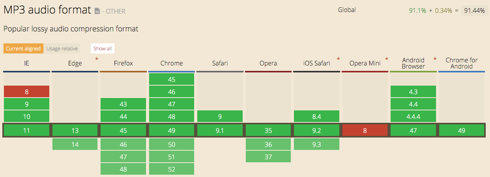
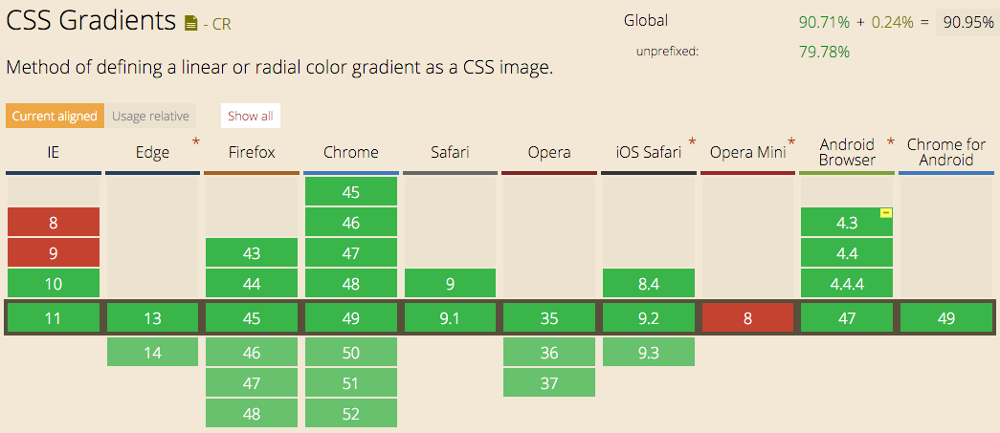
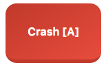
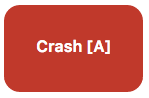

## Lesweek 3 - Progressive Enhanced Browser Technolgies

#### Use case: Beatbox

[Online Demo](http://linda2912.github.io/browserTechnologies/week3/)



##Keyboard fallback

```
<button></button>
```

##JavaScript fallback

``` 
<audio></audio> 
```



JavaScript maakt de buttons zichtbaar en de audio elementen onzichtbaar.

```
var buttons = document.getElementById('buttonBox').classList.remove('invisible');
var audioControls = document.getElementById('audioControls').classList.add('invisible');`
```
##CSS & JavaScript fallback



##Audio element fallback



```
<audio controls>
	<source src="beat/crash.wav" type="audio/wav">
	<p>Your browser does not support the audio element. </p>
	<a href="beat/crash.mp3">Play Crash</a>
</audio>
```

##Audio types fallback




```
<audio controls>
	<source src="beat/crash.wav" type="audio/wav">
	<source src="beat/crash.mp3" type="audio/mp3">
</audio>
```


##Linear-gradient fallback



```
background-color: #c0392b;
background: linear-gradient(to bottom right, #c0392b , #e74c3c);
```

