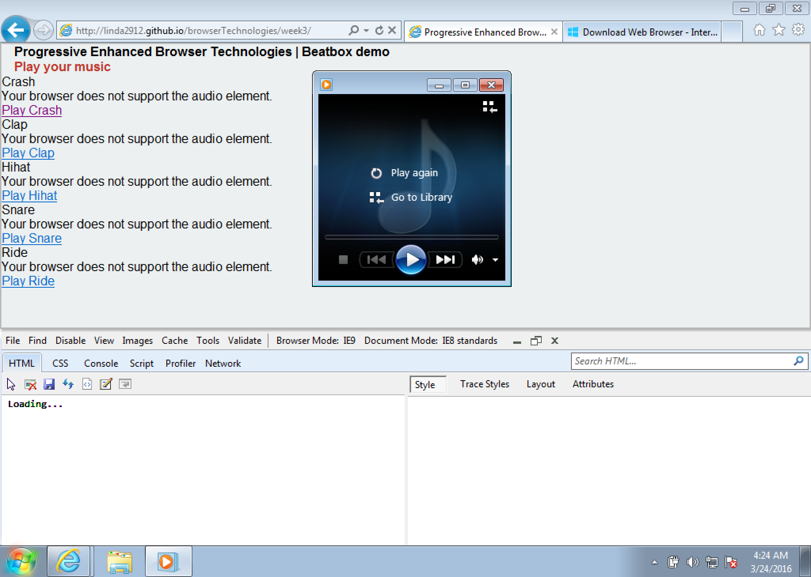

## Lesweek 3 - Progressive Enhanced Browser Technolgies

#### Use case: Beatbox

[Online Demo](http://linda2912.github.io/browserTechnologies/week3/)


##Keyboard fallback

```
<button></button>
```
Als de gebruiker geen gebruik kan maken van een keyboard, kan er ook op de buttons geklikt worden.

##JavaScript fallback

``` 
<audio></audio> 
```
JavaScript maakt de buttons zichtbaar en de audio elementen onzichtbaar. Zodra er geen JavaScript beschikbaar is laat de browser alleen de audio elementen zien.


```
var buttons = document.getElementById('buttonBox').classList.remove('invisible');
var audioControls = document.getElementById('audioControls').classList.add('invisible');`
```


##JavaScript & CSS fallback

Zodra er geen JavaScript en geen CSS beschikbaar zijn blijven de functionaliteiten functioneel.


##Audio element fallback

Het audio element wordt niet ondersteund door IE8 en Opera Mini. Op deze browsers wordt er het alternatief aangeboden dat de gebruiker de sound kan downloaden en afspelen.


**Oplossing:**

```
<audio controls>
	<source src="beat/crash.mp3" type="audio/mp3">
	<p>Your browser does not support the audio element.</p>
	<a href="beat/crash.mp3">Play Crash</a>
</audio>
```
**IE8:**



##Linear-gradient fallback

Linear-gradient wordt opgevangen in browsers die het niet ondersteunen door middel van een gewone ```background-color```


```
background-color: #c0392b;
background: linear-gradient(to bottom right, #c0392b , #e74c3c);
```

