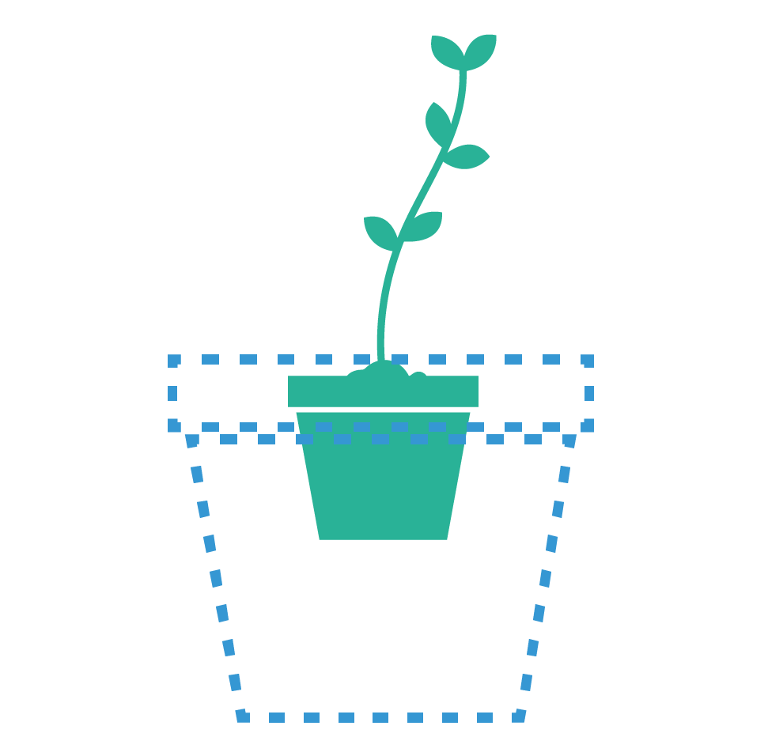

##Internet of Things
#### Project: Watch your plant with a Arduino Sensor
###### At the end of this manual you know exactly when you have to repot your vegetable plot.

When your plant is 5cm 

http://www.instructables.com/id/How-to-make-A-light-up-distance-sensor/step4/The-code/