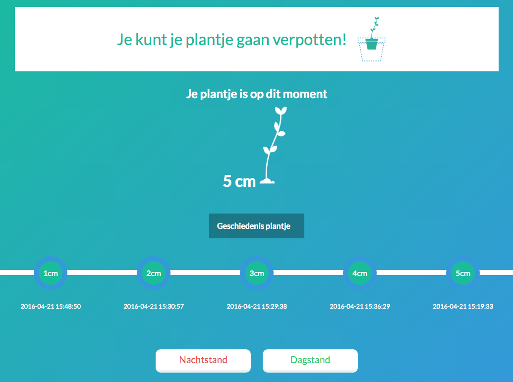

#How to know exaclty when you have to repot your vegetable plot?




This manual will explain how you can measure the length of your plants with a Wemos ESP and how you can do cool stuff with the data in a browser.


##What you need 
* Breadboard
* Arduino with WiFi (I used a Wemos)
* USB Cable to connect Arduino
* HC-SR04 Ultrasonic Sensor 
* 5 led's
* 5 Resistors
* A few cables
* A URL and hosting

##Setup your hardware

In this part, I will show you how to make a sensor that will light up more lights the closer you are to it.


####1. Placing the electronics


| Hardware        | Port           
| ------------- |:-------------:| 
| HC-SR04 Sensor Trig     | D1 | 
| HC-SR04 Sensor Echo     | D2 | 
| Led 1      | D0      |   
| Led 2 | D5      | 
| Led 3 | D6      |  
| Led 4 | D7      | 
| Led 5 | D8      | 

I used this ports, but you can also do it your own way. For more explaination use the tutorial in the next step.

####2. Arduino code

Now you have to write some Arduino code to control the hardware. [This tutorial](http://www.instructables.com/id/How-to-make-A-light-up-distance-sensor) explains exactly how to do that. It will explain how to make a sensor that will light up more lights the closer you are.

This is how my code looks like after this tutorial:

```
int led1 = D0;
int led2 = D5;
int led3 = D6;
int led4 = D7;
int led5 = D8;
int trigPin = D1;
int echoPin = D2;

void setup() {
  pinMode(trigPin, OUTPUT);
  pinMode(echoPin, INPUT);
  pinMode(led1, OUTPUT);
  pinMode(led2, OUTPUT);
  pinMode(led3, OUTPUT);
  pinMode(led4, OUTPUT);
  pinMode(led5, OUTPUT);

  Serial.begin(9600);
}

void loop() {
	
	int duration, distance;
	digitalWrite(trigPin, LOW); 
	delayMicroseconds(200); 
	digitalWrite(trigPin, HIGH);
	delayMicroseconds(1000);
	digitalWrite(trigPin, LOW);
	duration = pulseIn(echoPin, HIGH);
	distance = (duration/2) / 29.1;
	Serial.print ("distance ");
	Serial.println (distance);
	delay(500);
	String plant;

	if (distance < 9) {
		digitalWrite(led1, HIGH); 
		Serial.println("Your plant is 1cm!");
		plant = "1";
	}  
	if (distance > 9) {       
		digitalWrite(led1, LOW);
		plant = "0";
	}
	if (distance < 8) {
		digitalWrite(led2, HIGH); 
		Serial.println("Your plant is 2cm!");
		plant = "2";
	}  
	if (distance > 8) {       
		digitalWrite(led2, LOW); 
	}    
	if (distance < 7) {
		digitalWrite(led3, HIGH); 
		Serial.println("Your plant is 3cm!");
		plant = "3";
	}  
	if (distance > 7) {       
		digitalWrite(led3, LOW); 
	}  
	if (distance < 6) {
		digitalWrite(led4, HIGH); 
		Serial.println("Your plant is 4cm!");
		plant = "4";
	}  
	if (distance > 6) {       
		digitalWrite(led4, LOW); 
	} 
	if (distance < 5) {
		digitalWrite(led5, HIGH);
		Serial.println("Your plant is 5cm!"); 
		plant = "5";
	}  
	if (distance > 5) {       
		digitalWrite(led5, LOW); 
	}
} 

```


##Connect your Wifi

To connect your Wemos with Wifi you have to put some code into your Arduino code.

First you have to put code this on the top of your  ```Arduino file```.

```
//Arduino code

#include <ESP8266WiFi.h>
#include <ESP8266WiFiAP.h>
#include <ESP8266WiFiGeneric.h>
#include <ESP8266WiFiMulti.h>
#include <ESP8266WiFiScan.h>
#include <ESP8266WiFiSTA.h>
#include <ESP8266WiFiType.h>
#include <WiFiClient.h>
#include <WiFiClientSecure.h>
#include <WiFiServer.h>
#include <WiFiUdp.h>

#include <ESP8266HTTPClient.h>
char ssid[] = "Wifi name"; //change this into your own 
char pass[] = "Wifi password"; //change this into your own 
//int status = WL_IDLE_STATUS;
WiFiClient  client;

``` 
Then put this into the ```void setup(){..}```

```
//Arduino code

WiFi.begin(ssid, pass);
```

Now you can connect with your Wifi! Note if you use your hostspot, don't forget to turn on your hostspot ;)

##Turn lights with buttons
I wanted to turn all light with buttons on my website to do this you can follow [this tutorial](http://blog.nyl.io/esp8266-led-arduino/). 

##Making a json data file

To do cool stuff with the data it is necessary to create a structured json file that will be looks like this:

```
[
	{
		time: "",
		plant: ""
	}
]
```

####1. Server
To do this you first have to be sure that you have the following files created

```
yourServer.nl 
	└── newDirectory
			├── index.php
			├── plant.json
			└── output.txt
			 
```
####2. Arduino code
Then you have to add some new code into your Arduino file to link your server and files.

On the top of your ```Arduino code``` you have to add this

```
//Arduino code

char* host = "www.yourServer.nl"; // change this into your own website name
String path = "newDirectory/plant.json"; // change this if you have changed the directory map name.
const int httpPort = 80;
```
And in the ```void loop(){..}``` add this

```
 // Arduino code
 
 String data;

 data = "plant="+plant;
 //check if and connect the nodeMCU to the server
 if (client.connect(host, httpPort)) {
   //make the POST headers and add the data string to it
   client.println("POST /newDirectory/index.php HTTP/1.1"); //change this if necessary
   client.println("Host: www.yourServer.nl:80"); //changes into your own website
   client.println("Content-Type: application/x-www-form-urlencoded");
   client.println("Connection: close");
   client.print("Content-Length: ");
   client.println(data.length());
   client.println();
   client.print(data);
   client.println();
   Serial.println(data);
   Serial.println("Data send");
 } else {
   Serial.println("Something went wrong");
 }
     
  // wait .5s to reloop this loop
  delay(500);
```

Be sure you defined the plant length in your void loop like this

```
if (distance < 9) {
	plant = "1"; //add this if you had not already
	digitalWrite(led1, HIGH); 
}  
```
And create ```String plant;```
 
To see how I did look in my example in **Setup your hardware** Step 2.

####3. Getting the data in a json file

To write down your data into a ```json``` file we have to write some code into the ```index.php``` file.

```
<?php 
    if ($_SERVER["REQUEST_METHOD"] === "POST") {
      
        $data = $_POST["plant"];

        $timestamp = new DateTime();
        $time = $timestamp->format("Y-m-d H:i:s");

        $message = array("time" => $time, "plant" => $data);

        $inp = file_get_contents("plant.json");
        $tempArray = json_decode($inp);
        array_push($tempArray, $message);
        $jsonData = json_encode($tempArray);
        file_put_contents("plant.json", $jsonData);
    }
?>
```

Now the data will send the time and length into the ```plant.json``` file wich will looks like this

```
[
	{
		time: "2016-04-21 15:19:33",
		plant: "5"
	},
	{
		time: "2016-04-21 15:19:40",
		plant: "5"
	},
	{
		time: "2016-04-21 15:19:47",
		plant: "5"
	}
}
```
##That's it!

Now you can make some cool stuff! If you want to see how my cool stuff looks like you can visit my [website](http://lindavandijkdesign.nl/iot/eindopdracht). And to look at the code I used you can take a look in my files wich you can find [here](https://github.com/linda2912/linda2912.github.io/tree/master/internetOfThings/week3).

Thanks for reading!
