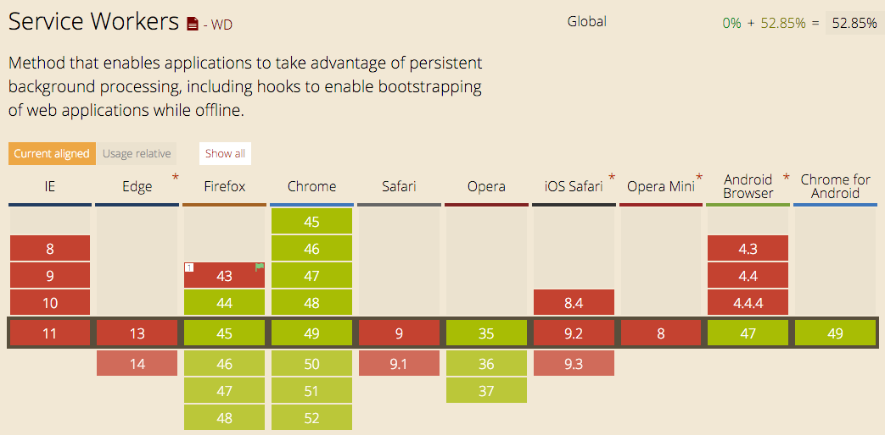

#Progressive Web App
Een Web App die door middel van een Service Worker een Native App nadoet.

#####Voordelen
* Mogelijkheid tot pushnotificaties
* Een PWA kan voor android en iOS gebruikt worden en is dus goedkoper om te ontwikkelen
* Je hoeft geen app te installeren en gebruikt dus geen opslagruimte op je telefoon
app-like-experience?
* Ze worden geïndexeerd door zoekmachines, waardoor ze goed zijn voor de SEO.
* Je hoeft als ontwikkelaar geen rekening te houden met de specs van Google Play en de App Store
* Als developer kun je meteen nieuwe versies lanceren en bugfixes doorvoeren
* De gebruiker hoeft de app niet meer te updaten via de appstore
* Bevat een snelle laadtijd door middel van een service worker die op de achtergrond van de telefoon draait.

#####Wat heb je nodig voor een Progressive Web App
* Server Worker
* Beveiligde https-verbinding
* Geldige SSL-certificaat

#####Nadelen
* De bezoeker krijgt pas een ‘add to homescreen’ notificatie in de browser pas nadat hij de website twee keer heeft bezocht binnen twee weken. Dit is wel op te lossen door middel van de bezoekers er op de homepage op te wijzen dat er een Progressive Web App beschikbaar is.
* Je bent niet vindbaar in de App Store als de gebruiker daar aan het zoeken is.
* Momenteel werken PWA's alleen op Android apparaten. Op Safari en iOS wordt de Service Worker (nog) niet ondersteund. 

#####Bevindingen
De Progressive Web App is nog niet optimaal maar zeker een goede nieuwe manier om apps te ontwikkelen. Aan native en web apps zitten beide nadelen verbonden. De Progressive Web App kan veel van deze nadelen opvangen en creëert een nieuwe interessante manier van apps maken. Wat ik voornamelijk een groot voordeel vind van een Progressive Web App is dat je de mogelijk hebt om pushnotifications te sturen. Hopelijk gaan iOS en Safari ook binnenkort de Service Worker ondersteunen. Alleen denk ik dat Apple niet erg blij is met deze innovatie aangezien de native apps hierdoor onaantrekkelijker worden.

#####Bronnen
* [https://developers.google.com/web/progressive-web-apps](https://developers.google.com/web/progressive-web-apps)
* [http://www.emerce.nl/achtergrond/progressive-web-apps-de-toekomst-van-mobiele-apps](http://www.emerce.nl/achtergrond/progressive-web-apps-de-toekomst-van-mobiele-apps)
* [http://caniuse.com/#search=service%20worker](http://caniuse.com/#search=service%20worker)