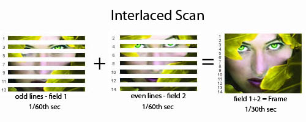
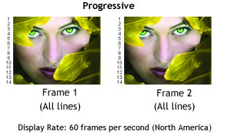

The following plugins are bundled with imagemin:

* gifsicle — Compress GIF images.
* jpegtran — Compress JPG images.
* optipng — Compress PNG images losslessly.
* svgo — Compress SVG images.

####.gifsicle(options)

Compress GIF images.

```
const Imagemin = require('imagemin');

new Imagemin()
    .use(Imagemin.gifsicle({interlaced: true}));
    
```


####.jpegtran(options)

Compress JPG images.

```
const Imagemin = require('imagemin');

new Imagemin()
    .use(Imagemin.jpegtran({progressive: true}));

```



####.optipng(options)

Lossless compression of PNG images.

```
const Imagemin = require('imagemin');

new Imagemin()
    .use(Imagemin.optipng({optimizationLevel: 3}));

```

> The optimization level 0 enables a set of optimization operations that require minimal effort. There will be no changes to image attributes like bit depth or color type, and no recompression of existing IDAT datastreams. The optimization level 1 enables a single IDAT compression trial. The trial chosen is what OptiPNG thinks it’s probably the most effective. The optimization levels 2 and higher enable multiple IDAT compression trials; the higher the level, the more trials.

Level and trials:

1. 1 trial
2. 8 trials
3. 16 trials
4. 24 trials
5. 48 trials
6. 120 trials
7. 240 trials

####.svgo(options)

Compress SVG images.

```
const Imagemin = require('imagemin');

new Imagemin()
    .use(Imagemin.svgo());
    
```