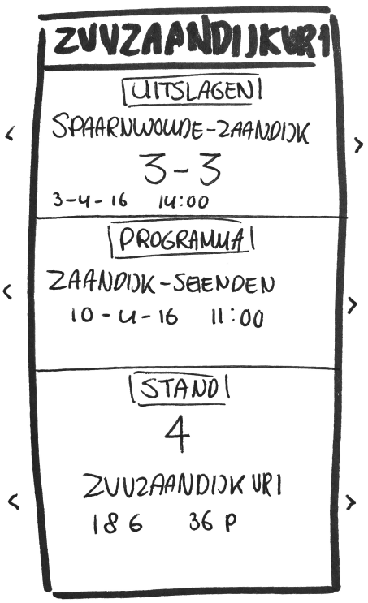

## Real Time Web

###### Week 1

#####Databron
Ik ga gebruik maken van de API van KNVB met de data van mijn voetbalclub ZVVZaandijk. Met deze API kan de volgende data ophalen:

* Teams
* Uitslagen
* Programma
* Stand
* Wedstrijden
* Competities

Deze data is Betrouwbaar en selectief voor mij een maand vrijgesteld.

##### Concept idee

Het idee van het concept is dat een speler van een specifiek team een duidelijk overzicht van de uitslagen, programma en stand kan zien.

##### MVP versie

Features

* Real-time uitslagen
* Real-time programma
* Real-time stand

Zodra er uitslagen bekend zijn, veranderen de drie velden(uitslagen, programma en stand) automatisch zonder de pagina opnieuw te moeten laden (reactiveness)

##### Wishlist

* Een melding ontvangen als er iets voor jouw gekozen team veranderd
* Een ander team kunnen selecteren
* Een detail pagina voor ieder onderdeel (uitslagen, programma en stand)

##### Ideeën voor aanvulling van andere

Martijn: pushnotifacties sturen zodra er een uitslag bekend is.
 